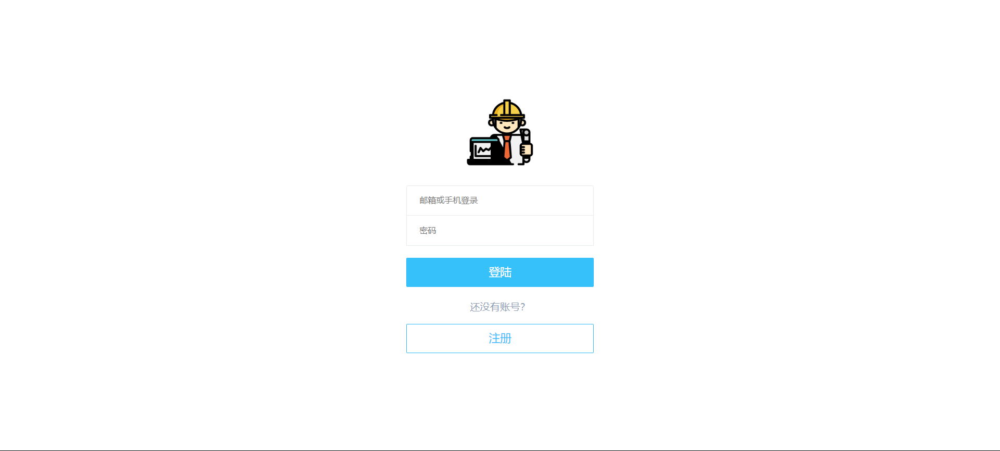
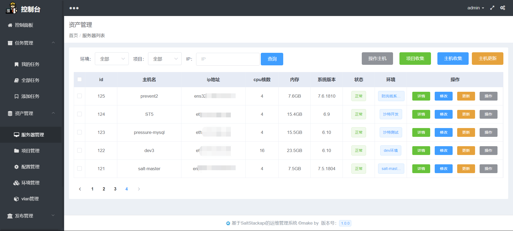
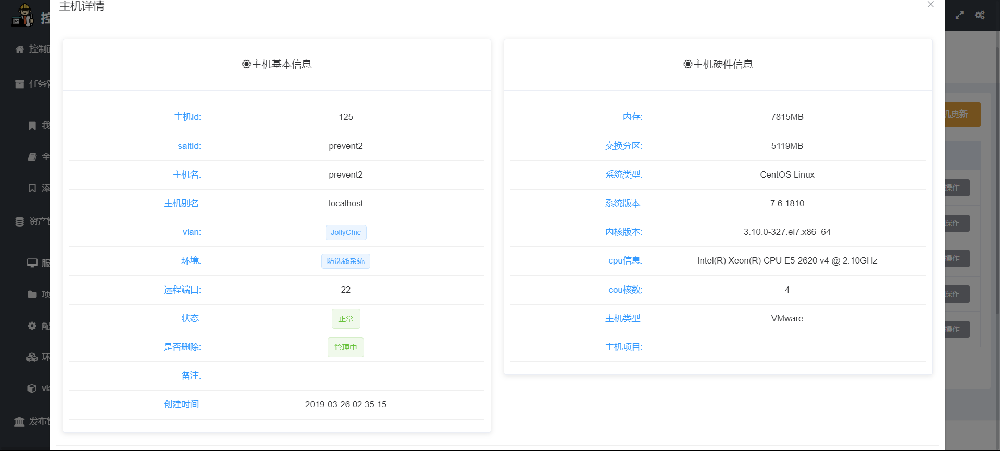
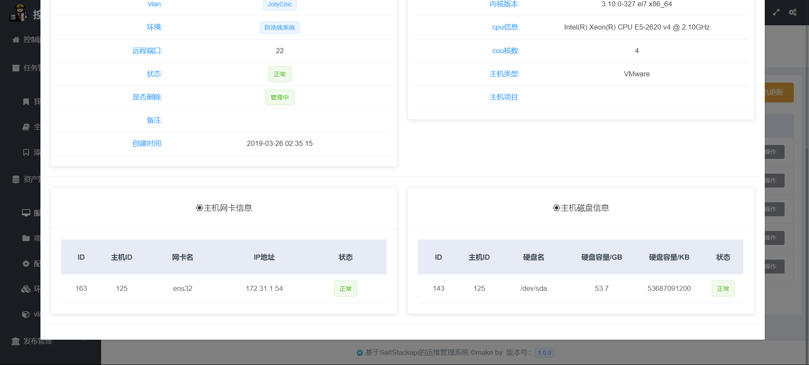
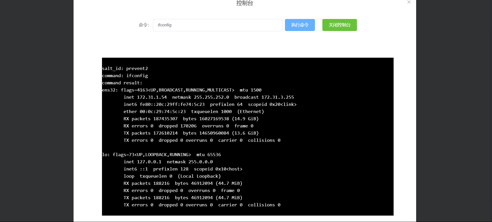
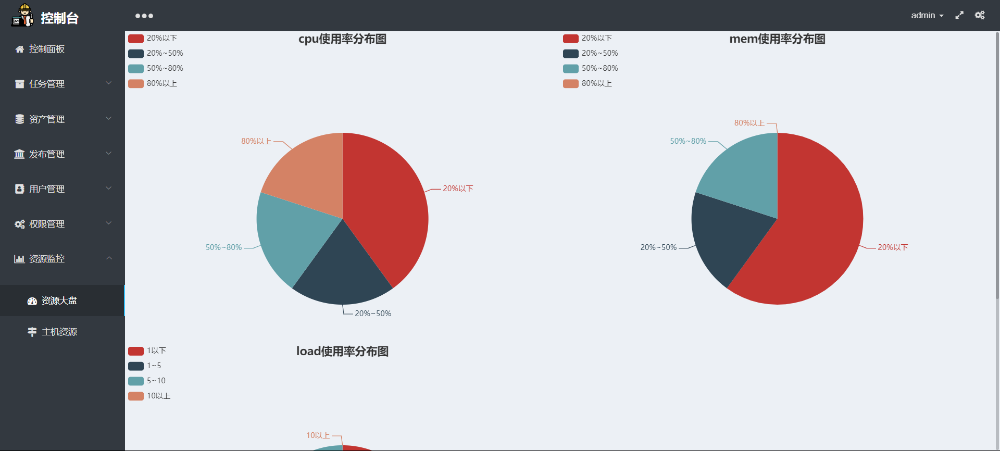

## 安装方法

1.下载nodejs安装包，根据提示安装
    https://nodejs.org/dist/v10.14.1/node-v10.14.1-x64.msi

2.安装vue环境，安装vue脚手架工具
    npm install --global vue-cli


3.修改配置文件

### config/index.js

```
  dev: {
    // api访问地址
    assetsSubDirectory: 'static',
    assetsPublicPath: '/',
    proxyTable: {
      '/api': {
        target: 'http://172.28.20.62:8000', # 修改为python后端监听地址
        changeOrigin: true,
        pathRewrite: {
          '^/api': ''
        }
      }
    },

    // 监听地址与端口配置
    host: '172.28.20.62',  # 访问入口ip
    port: 80,              # 访问入口端口
    autoOpenBrowser: false,
    errorOverlay: true,
    notifyOnErrors: true,
    poll: false,
    useEslint: false,
    showEslintErrorsInOverlay: false,
    devtool: 'cheap-module-eval-source-map',
    cacheBusting: true,
    cssSourceMap: true
  },
```


4.进入项目径路运行命令

    npm install
    npm run dev


5.项目效果图展示
#####登录界面

#####登录界面

#####登录界面

#####登录界面

#####登录界面

#####登录界面

####--功能很多,喜欢就要自己努力搭建出去来能看到啦
